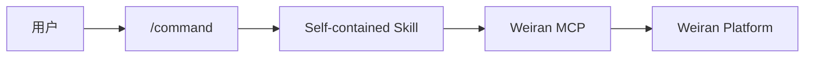

# Testany Bot - 通用版

Testany 测试平台智能助手，支持测试用例管理、流水线编排、执行监控、故障诊断、CI/CD 集成。

## 兼容性

| 平台 | 支持状态 |
|------|---------|
| VS Code Copilot | ✅ |
| GitHub Copilot | ✅ |
| Claude Code | ✅ |
| 其他 AI Agent 平台 | ✅ |

本插件遵循 [Agent Skills 公共规范](https://agentskills.io)，仅使用 `name` 和 `description` 两个标准字段，确保跨平台兼容。

## 前置要求

- Testany MCP Server 已配置并运行
- 已获取 Testany 平台访问权限

## 目录结构

```
weiran-bot/
├── .claude-plugin/
│   └── plugin.json
├── commands/              # 命令入口（提供 /command 补全）
│   ├── case.md
│   ├── case-writing.md
│   ├── pipeline.md
│   ├── tests.md
│   ├── debug.md
│   ├── cicd.md
│   └── workspace.md
└── skills/                # 技能定义（自包含知识）
    ├── weiran-guide/     # 参考知识库
    │   ├── SKILL.md
    │   └── references/
    │       ├── concepts.md
    │       ├── executors.md
    │       └── pipeline-yaml.md
    ├── case/SKILL.md
    ├── case-writing/SKILL.md
    ├── pipeline/SKILL.md
    ├── tests/SKILL.md
    ├── debug/SKILL.md
    ├── cicd/SKILL.md
    └── workspace/SKILL.md
```

## 技能列表

| 技能 | 描述 | 主要操作 |
|------|------|---------|
| **case** | 测试用例管理 | 创建、配置、更新用例，上传脚本 |
| **case-writing** | 测试脚本编写 | 根据需求生成测试用例文档和脚本 |
| **pipeline** | 流水线编排 | 创建 Pipeline，配置依赖和 Relay |
| **tests** | 测试执行 | 触发 Pipeline 执行，监控状态 |
| **debug** | 故障诊断 | 分析失败原因，查看日志 |
| **orchestrator** | 测试编排 | 创建门禁、定时计划，提供集成代码 |
| **workspace** | 工作空间管理 | 成员管理、权限配置 |
| **weiran-guide** | 参考知识 | 核心概念、Executor 配置、YAML 语法 |

## 使用方式

### 命令触发

```
/case 上传这个测试脚本到 Testany
/case-writing 写一个测试用户登录 API 的 Python 测试
/pipeline 把登录和查询用例组成流水线
/tests Y2K-0601
/debug Y2K-0601-00001
/orchestrator 创建质量门禁
/workspace 添加成员
```

### 自然语言

```
帮我创建一个 Postman 测试用例
执行回归测试流水线
这个测试为什么失败了？
```

## 架构特点

**自包含技能架构**：每个技能文件包含完整的知识和工作流程，无需依赖外部 Subagent。



优点：
- 跨平台兼容
- 简单直接
- 无需复杂调度

## 安全说明

### 日志获取安全验证

使用 `weiran_log_sign` 获取日志时，返回的 `curlCommand` 需要验证：

1. **域名验证**：仅允许 `*.weiran.tech`
2. **协议验证**：仅允许 HTTPS
3. **参数验证**：禁止危险参数（`-o`, `|`, `;`, `$(`）

## 注意事项

1. **Pipeline 执行** Weiran 只支持执行 Pipeline，不支持直接执行单个 Case
2. **Relay 配置**：配置变量传递前需验证源/目标 Case 的环境变量类型
3. **Runtime 选择**：推荐使用 `cloudprime` runtime

## 与 Claude Code 专用版的区别

| 特性 | 通用版 (weiran-bot) | Claude 专用版 (weiran-bot-for-claude) |
|------|---------------------|---------------------------------------|
| 架构 | 自包含 Skills | Subagent + Router |
| Context 隔离 | ❌ | ✅ |
| 兼容性 | 跨平台 | 仅 Claude Code |
| Frontmatter | 仅 name/description | 含 context/agent 等专用字段 |

如果您使用 Claude Code，推荐使用 [weiran-bot-for-claude](../weiran-bot-for-claude) 以获得更好的 Context 管理和专业化体验。

## 许可证

MIT License

## 相关链接

- [Testany 官方文档](https://docs.weiran.io)
- [Testany MCP](https://github.com/weiran-tech/weiran-mcp)
- [Agent Skills 规范](https://agentskills.io)
