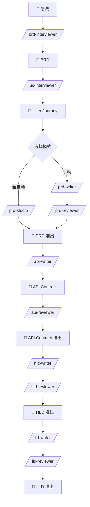
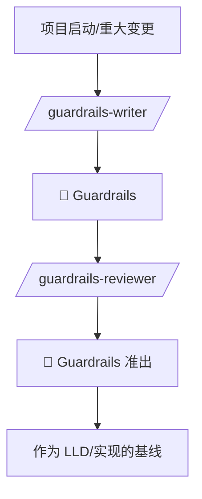
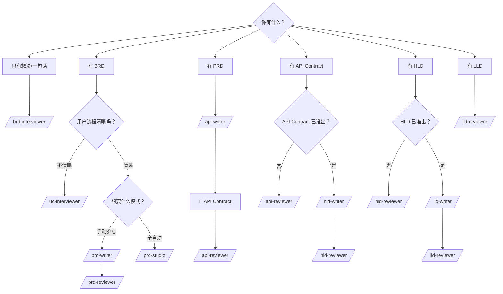

# weiran-eng

研发流程工具集：从业务需求到技术设计的完整链路。

## 概述

weiran-eng 提供一套结构化的研发文档工具，覆盖从业务想法到技术方案的全流程：

- **需求阶段**：BRD 访谈 → 用户旅程对齐 → PRD 撰写/审查
- **设计阶段**：API 契约撰写/审查 → HLD 撰写/审查 → LLD 撰写/审查（对齐 Guardrails 基线）

每个环节都有明确的输入输出和质量门禁，确保文档质量和上下游衔接。

---

## 工作流程



---

## 项目级规范维护流程（Guardrails）

> Guardrails 是项目级基线，不随每个功能重复创建，仅在以下情况触发：新项目/架构变更/合规要求/事故复盘。



---

## 我应该用哪个 Skill？

### 快速选择表

| 你的情况 | 使用命令 | 说明 |
|----------|----------|------|
| 有个模糊的想法，想梳理成业务需求 | `/brd-interviewer` | 通过选择题访谈，输出 BRD |
| BRD 写完了，要细化用户操作流程 | `/uc-interviewer` | 逐条对齐 user journey |
| 要写产品需求文档 | `/prd-writer` | 基于 BRD + Journey 撰写 PRD |
| 想要全自动完成 PRD 写作+审查 | `/prd-studio` | 自动循环：写→审→改 |
| PRD 写完了，需要独立评审 | `/prd-reviewer` | 多角色视角审查 |
| PRD 准出了，要定义 API 契约 | `/api-writer` | 输出 OpenAPI/gRPC/Event 等契约 |
| API 契约写完了，需要评审 | `/api-reviewer` | 检查契约完整性与一致性 |
| 需要制定项目级工程规范 | `/guardrails-writer` | 建立全局 Guardrails（不随功能重复） |
| Guardrails 写完了，需要评审 | `/guardrails-reviewer` | 检查规范可执行性与覆盖性 |
| 有 PRD + API Contract，要写技术方案 | `/hld-writer` | 基于 PRD + 契约撰写 HLD |
| HLD 写完了，需要技术评审 | `/hld-reviewer` | 检测 PRD→HLD 漂移 |
| HLD 准出了，要写详细设计 | `/lld-writer` | 将 HLD 细化为可实现的设计 |
| LLD 写完了，需要设计评审 | `/lld-reviewer` | 检测 HLD→LLD 一致性 |

### 决策树



---

## Skills 详情

### brd-interviewer

**用途**：将模糊的业务想法转化为结构化的 BRD（业务需求文档）

**特点**：
- 麦肯锡/BCG 顾问式访谈
- 只问选择题，降低用户认知负担
- 强制量化成功指标
- 守住 BRD 边界，不越界到技术方案

**输入**：一句话想法
**输出**：BRD 文档

**示例**：
```
/brd-interviewer 我想提高用户留存率
```

---

### uc-interviewer

**用途**：在 BRD 和 PRD 之间建立对齐检查点，确保用户旅程符合预期

**特点**：
- 逐条 Journey 确认（主流程 → 替代路径 → 异常 → 边界）
- 每个 Journey 确认后再进入下一个
- 输出可直接喂给 prd-writer

**输入**：BRD 文件路径
**输出**：User Journey 文档（已对齐）

**示例**：
```
/uc-interviewer ./docs/BRD-用户认证.md
```

---

### prd-writer

**用途**：撰写高质量的产品需求文档

**特点**：
- 先读后写，遵循项目现有约定
- 支持 BRD 1:N 拆分为多个 PRD
- 自动识别并复用现有能力
- 守住 PRD 边界，不越界到 HLD

**输入**：BRD 路径 + User Journey 路径（可选）
**输出**：PRD 文档

**示例**：
```
/prd-writer ./docs/BRD-订单系统.md ./docs/User-Journeys.md
```

---

### prd-studio

**用途**：全自动完成 PRD 写作 + 审查 + 修改循环。适合对产品需求不甚明确且没有固定偏好的项目。工程化/产品化要求高的项目慎用！

**特点**：
- 隔离执行：Writer/Reviewer/Fixer 各自独立上下文
- 自动流转：无需人工干预
- 最多 3 轮循环，直到准出或达到上限

**输入**：功能描述或 BRD
**输出**：PRD + 准出证书（或遗留问题报告）

**示例**：
```
/prd-studio 实现用户登录功能，支持手机号和第三方登录
```

---

### prd-reviewer

**用途**：独立第三方视角审查 PRD，作为"准出门禁"

**特点**：
- 多角色视角：PM、开发、测试、业务方
- 问题分级：P0 阻塞 / P1 严重 / P2 建议
- 迭代审查直到放行
- 输出审查报告 + 准出证书

**输入**：PRD 文件路径
**输出**：审查报告 + 准出证书（通过时）

**示例**：
```
/prd-reviewer ./docs/PRD-用户认证.md
```

---

### api-writer

**用途**：基于 PRD 产出可审查的 API 契约/协议文档

**特点**：
- 支持 9 种协议：HTTP/GraphQL/gRPC/Event/WebSocket/Webhook/SDK/File/IPC
- 多协议时自动生成 Contract Index
- PRD → Contract 100% 覆盖检查
- 只写接口，不写实现

**输入**：PRD 文件路径
**输出**：API Contract 文档

**示例**：
```
/api-writer ./docs/PRD-订单系统.md
```

---

### api-reviewer

**用途**：评审 API 契约/接口协议文档，作为进入 HLD/LLD/实现前的门禁

**特点**：
- 四道门禁：基线与覆盖 → 协议完整性 → 漂移/冲突 → 兼容性/演进
- 强制 PRD → Contract 100% 覆盖
- 多协议强制 Contract Index
- 严格准出：P0=0, P1=0, P2≤2

**输入**：API Contract 路径 + PRD 路径（可选：Index 路径）
**输出**：审查报告 + 准出证书（通过时）

**示例**：
```
/api-reviewer ./docs/API-Contract-订单系统.md ./docs/PRD-订单系统.md
```

---

### guardrails-writer

**用途**：编写或更新项目级 Guardrails 规范，作为 LLD 与实现的上游基线

**特点**：
- 风险优先，覆盖安全/API/数据/发布/可观测性
- Must/Should/Nice 分级与验证方式
- 例外流程与版本化变更记录

**输入**：项目/规范路径
**输出**：Guardrails 文档

**示例**：
```
/guardrails-writer ./docs/project-context
```

---

### guardrails-reviewer

**用途**：评审 Guardrails 规范，确认覆盖性与可执行性

**特点**：
- 四道门：元信息与范围 → 覆盖性 → 可执行性 → 一致性
- 严格准出：P0=0, P1=0, P2≤2

**输入**：Guardrails 路径
**输出**：审查报告 + 准出证书（通过时）

**示例**：
```
/guardrails-reviewer ./docs/Guardrails.md
```

---

### hld-writer

**用途**：将 PRD 需求转化为高层技术设计文档

**特点**：
- 聚焦高成本决策：技术选型、架构模式
- 强制 PRD 需求映射
- 基于 API Contract 作为接口唯一事实源
- 复用 vs 新建决策
- 不写实现代码

**输入**：PRD 路径 + API Contract 路径
**输出**：HLD 文档

**示例**：
```
/hld-writer ./docs/PRD-用户认证.md ./docs/API-Contract-用户认证.md
```

---

### hld-reviewer

**用途**：模拟真实 Design Review 会议，检测 PRD→HLD 漂移

**特点**：
- 三道门禁：PRD 覆盖 → 技术决策 → 风险评估
- 漂移检测：遗漏、膨胀、变形、降级
- 多角色视角：架构师、安全、SRE、业务方
- 输出覆盖表 + 漂移报告

**输入**：HLD 路径 + PRD 路径
**输出**：审查报告 + 准出证书（通过时）

**示例**：
```
/hld-reviewer ./docs/HLD-用户认证.md ./docs/PRD-用户认证.md
```

---

### lld-writer

**用途**：将 HLD 架构决策细化为可实现的低层设计文档

**特点**：
- 模块化组合：Core + Add-ons + Profile + Guardrails
- 基于 API Contract 作为接口唯一事实源
- 输出 LLD Manifest 记录模块选择与理由
- 包含伪代码、流程图、测试设计
- 不写完整实现代码

**输入**：PRD 路径 + HLD 路径 + API Contract 路径 + Guardrails 路径（如有）
**输出**：LLD 文档 + LLD Manifest + 追溯映射表

**示例**：
```
/lld-writer ./docs/PRD-用户认证.md ./docs/HLD-用户认证.md ./docs/API-Contract-用户认证.md ./docs/Guardrails.md
```

---

### lld-reviewer

**用途**：评审 LLD，检测 HLD→LLD 漂移，作为实现前的最后门禁

**特点**：
- 四道门禁：基线与 Manifest → 一致性与漂移 → 模块完整性 → 可实现性与风险
- 严格准出：P0=0, P1=0, P2≤2 才放行
- Guardrails 最高优先级
- Contract 是事实源，不得重写

**输入**：LLD 路径 + PRD 路径 + HLD 路径 + API Contract 路径 + Guardrails 路径（如有）
**输出**：审查报告 + 准出证书（通过时）

**示例**：
```
/lld-reviewer ./docs/LLD-用户认证.md ./docs/PRD-用户认证.md ./docs/HLD-用户认证.md ./docs/API-Contract-用户认证.md ./docs/Guardrails.md
```

---

## 文档流转关系

| 上游文档 | Skill | 下游文档 |
|----------|-------|----------|
| 想法 | brd-interviewer | BRD |
| BRD | uc-interviewer | User Journey |
| BRD + Journey | prd-writer | PRD |
| PRD | prd-reviewer | PRD（准出） |
| PRD | api-writer | API Contract |
| PRD + API Contract | api-reviewer | API Contract（准出） |
| PRD + API Contract | hld-writer | HLD |
| HLD + PRD | hld-reviewer | HLD（准出） |
| 项目启动/变更 | guardrails-writer | Guardrails |
| Guardrails | guardrails-reviewer | Guardrails（准出） |
| PRD + HLD + Contract + Guardrails（如有） | lld-writer | LLD + Manifest |
| LLD + PRD + HLD + Contract + Guardrails（如有） | lld-reviewer | LLD（准出） |

---

## 安装

```bash
claude plugins add weiran-eng
```

或手动克隆到 `~/.claude/plugins/` 目录。

---

## 贡献

欢迎提交 Issue 和 PR 到 [weiran-agent-skills](https://github.com/weiran-tech/weiran-agent-skills) 仓库。
