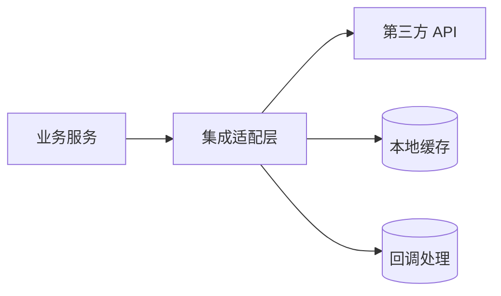

# HLD 模板：第三方集成

> 以下为模板内容，复制后根据实际情况填写。

---

# [第三方服务] 集成技术设计

## 元信息

| 项目 | 内容 |
|------|------|
| 关联 PRD | [PRD 文档链接] |
| 第三方服务 | [服务名称] |
| 版本 | v1.0 |
| 作者 | [作者] |

## PRD↔HLD 需求映射表

**本 HLD 覆盖范围**：[范围]（1:N 场景必填）
**索引文档**：[HLD-INDEX-xxx.md](路径)（1:N 场景必填）

| PRD 条目 | 验收标准 | HLD 章节 | 状态 |
|----------|---------|---------|------|
| [FR-XXX] | [验收标准] | [对应章节] | ✓/进行中/待定 |

## 1. 集成概述

### 1.1 业务背景
[为什么需要集成此服务]

### 1.2 集成范围
| 能力 | 是否集成 | 说明 |
|------|---------|------|
| [能力1] | 是/否 | [说明] |

### 1.3 第三方服务信息
| 项目 | 内容 |
|------|------|
| 服务商 | [服务商] |
| API 版本 | [版本] |
| 文档地址 | [链接] |
| SLA | [SLA] |

## 2. 技术架构

### 2.1 集成架构

### 2.2 复用盘点

| 能力需求 | 候选方案 | 评估结论 | 来源 |
|---------|---------|---------|------|
| 第三方集成 | 已有适配器 / 开源 SDK / 自研 | [选择及理由] | [文档/代码路径] |
| [其他能力] | [候选方案] | [选择及理由] | [文档/代码路径] |

> 说明：
> - 优先复用已有的适配器、开源 SDK、内部封装，自研需给出充分理由
> - **「来源」列必填**：必须注明从哪个文档或代码中识别到该候选方案，禁止无依据猜测

### 2.3 适配层设计
[为什么需要适配层、适配层职责]

## 3. 接口映射

### 3.1 调用第三方

| 业务场景 | 第三方接口 | 方法 | 说明 |
|---------|-----------|------|------|
| [场景1] | [接口] | POST | [说明] |

### 3.2 接收回调

| 回调类型 | 本地接口 | 处理逻辑 |
|---------|---------|---------|
| [类型1] | POST /callback/xxx | [逻辑] |

## 4. 数据映射（跨系统契约）

> 注意：此章节定义跨系统的数据契约，属于 HLD 范畴。内部数据表字段设计属于 LLD。

### 4.1 请求映射
| 本地概念 | 第三方字段 | 转换规则 |
|---------|-----------|---------|
| 用户标识 | user_id | 直接映射 |
| 金额 | amount_cents | 元转分 |

### 4.2 响应映射
| 第三方字段 | 本地概念 | 转换规则 |
|-----------|---------|---------|
| [字段] | [概念] | [规则] |

### 4.3 状态映射
| 第三方状态 | 本地状态 |
|-----------|---------|
| [状态] | [状态] |

## 5. 认证与安全

### 5.1 认证方式
[API Key / OAuth / 签名等]

### 5.2 密钥管理
[密钥存储、轮换策略]

### 5.3 数据安全
[敏感数据处理、传输加密]

## 6. 可靠性设计

### 6.1 超时与重试
| 场景 | 超时策略 | 重试策略 |
|------|---------|---------|
| 同步调用 | [策略] | [策略] |
| 异步回调 | [策略] | [策略] |

### 6.2 熔断降级
[熔断条件、降级方案]

### 6.3 幂等设计
[请求去重、回调去重]

### 6.4 对账机制
[定期对账策略]

## 7. 异常处理

### 7.1 错误码映射
| 第三方错误 | 本地错误码 | 处理策略 |
|-----------|-----------|---------|
| [错误] | [错误码] | [策略] |

### 7.2 异常场景
| 场景 | 处理方式 |
|------|---------|
| 第三方超时 | [方式] |
| 签名失败 | [方式] |
| 业务失败 | [方式] |

## 8. 测试策略

### 8.1 沙箱环境
| 环境 | 地址 | 用途 |
|------|------|------|
| 沙箱 | [地址] | 开发测试 |
| 生产 | [地址] | 线上 |

### 8.2 Mock 策略
[本地 Mock、集成测试策略]

## 9. 监控告警

### 9.1 关键指标
- 调用成功率
- 平均延迟
- 错误分布

### 9.2 告警规则
| 指标 | 阈值 | 告警级别 |
|------|------|---------|
| 成功率 | < X% | P1 |

### 9.3 埋点/监控设计（承接 PRD 成功指标）

| PRD 成功指标 | 埋点/监控设计 |
|-------------|--------------|
| [指标名] | [采集方式、存储、展示] |

## 10. 上线计划

### 10.1 灰度策略
[灰度比例、灰度条件]

### 10.2 回滚方案
[回滚步骤、影响范围]
