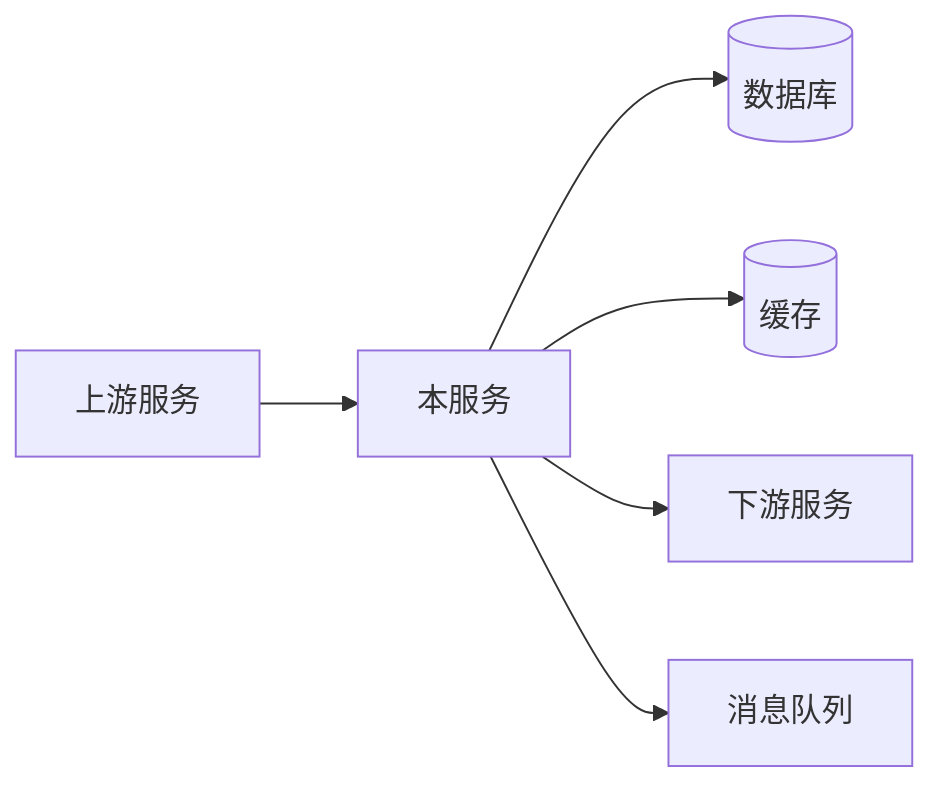
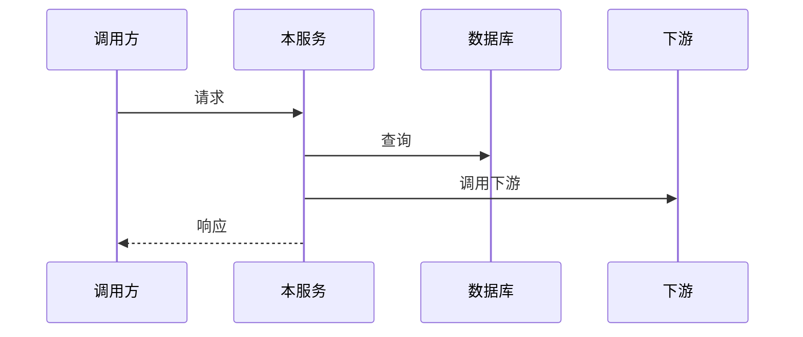

# HLD 模板：新功能（纯后端）

> 以下为模板内容，复制后根据实际情况填写。

---

# [功能名称] 技术设计文档

## 元信息

| 项目 | 内容 |
|------|------|
| 关联 PRD | [PRD 文档链接] |
| 版本 | v1.0 |
| 作者 | [作者] |
| 状态 | 草稿/评审中/已批准 |

## PRD↔HLD 需求映射表

**本 HLD 覆盖范围**：[范围]（1:N 场景必填）
**索引文档**：[HLD-INDEX-xxx.md](路径)（1:N 场景必填）

| PRD 条目 | 验收标准 | HLD 章节 | 状态 |
|----------|---------|---------|------|
| [FR-XXX] | [验收标准] | [对应章节] | ✓/进行中/待定 |

## 1. 背景与目标

### 1.1 业务背景
[简要描述，引用 PRD]

### 1.2 技术目标
- [目标 1]
- [目标 2]

### 1.3 非功能目标
| 指标 | 目标值 |
|------|--------|
| 吞吐量 | X QPS |
| 延迟 P99 | < Xms |
| 可用性 | X% |

### 1.4 技术现状与变更（如为已有系统新增功能）

#### 受影响的技术组件
| 组件 | 当前状态 | 变更内容 |
|------|----------|---------|
| [组件] | [当前] | [变更] |

#### 架构变更概述
[描述对现有架构的影响，如为全新系统可标注"不适用"]

## 2. 技术架构

### 2.1 系统架构



### 2.2 复用盘点

| 能力需求 | 候选方案 | 评估结论 | 来源 |
|---------|---------|---------|------|
| [能力1] | 内部模块 A / 第三方 B / 自研 | [选择及理由] | [文档/代码路径] |
| [能力2] | 共享服务 X / 自研 | [选择及理由] | [文档/代码路径] |

> 说明：
> - 优先复用内部模块/共享服务/第三方成熟方案，自研需给出充分理由
> - **「来源」列必填**：必须注明从哪个文档或代码中识别到该候选方案，禁止无依据猜测

### 2.3 技术选型

| 组件 | 选型 | 理由 |
|------|------|------|
| 语言/框架 | [选型] | [理由] |
| 数据库 | [选型] | [理由] |
| 缓存 | [选型] | [理由] |
| 消息队列 | [选型] | [理由] |

## 3. API 设计

> **注意**：若项目已有 OpenAPI/Swagger 规范，优先引用已有规范路径，避免重复维护。
> - 已有规范：填写「详见 `path/to/openapi.yaml#/paths/xxx`」
> - 新增接口：按下方模板填写详情

### 3.1 接口列表

| 接口 | 方法 | 路径 | 调用方 | 规范位置 |
|------|------|------|--------|----------|
| [接口1] | POST | /api/v1/xxx | [调用方] | 新增 / 详见 `openapi.yaml#L100` |

### 3.2 接口详情

> 仅对**新增接口**填写详情，已有规范的接口请引用规范路径。

#### POST /api/v1/xxx（新增）

**请求体**：
```json
{
  "field1": "string"
}
```

**响应体**：
```json
{
  "code": 0,
  "data": {}
}
```

**错误码**：
| 错误码 | 说明 |
|--------|------|
| 10001 | [说明] |

## 4. 数据设计

### 4.1 数据模型（概念级）

| 实体 | 说明 | 核心属性（概念） |
|------|------|-----------------|
| [实体] | [说明] | 标识、名称、时间戳等 |

> 注意：此处为概念模型，具体字段类型、长度等属于 LLD

### 4.2 索引策略
| 实体 | 索引策略 | 用途 |
|------|---------|------|
| [实体] | [策略描述] | [用途] |

### 4.3 数据生命周期
[数据保留策略、归档策略]

## 5. 关键流程

### 5.1 [流程名称]



### 5.2 异常处理
| 异常场景 | 处理策略 |
|---------|---------|
| 数据库超时 | [策略] |
| 下游失败 | [策略] |

## 6. 非功能设计

### 6.1 性能策略
- 缓存：[策略]
- 批处理：[策略]
- 异步处理：[策略]

### 6.2 可靠性策略
- 幂等设计：[策略]
- 重试机制：[策略]
- 熔断降级：[策略]

### 6.3 可观测性
- 关键指标：[指标列表]
- 告警规则：[规则]

## 7. 部署与运维

### 7.1 部署架构
[部署方式、实例数]

### 7.2 配置管理
[配置中心、环境差异]

### 7.3 兼容性设计（承接 PRD 兼容性要求）

| PRD 兼容性要求 | 技术实现方案 |
|---------------|-------------|
| [接口兼容] | [技术方案] |
| [数据兼容] | [技术方案] |

### 7.4 发布策略

| 策略 | 设计 |
|------|------|
| 灰度方案 | [灰度范围、灰度条件] |
| 功能开关 | [开关设计，如需要] |
| 回滚方案 | [回滚步骤、回滚条件] |

### 7.5 埋点/监控设计（承接 PRD 成功指标）

| PRD 成功指标 | 埋点/监控设计 |
|-------------|--------------|
| [指标名] | [采集方式、存储、展示] |

## 8. 风险与依赖

| 风险/依赖 | 说明 | 缓解措施 |
|----------|------|---------|
| [项目] | [说明] | [措施] |
