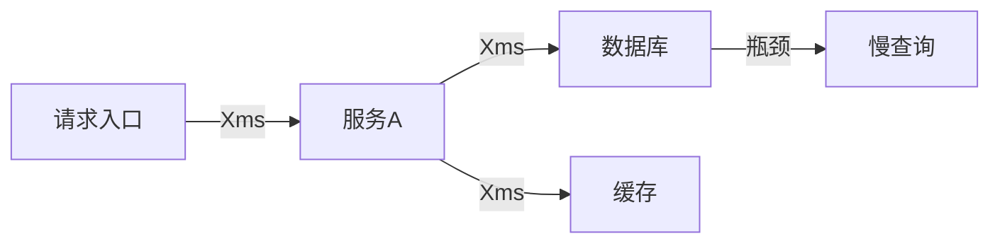
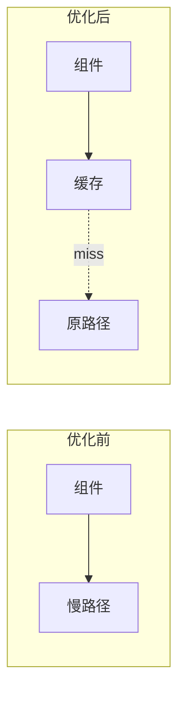

# HLD 模板：性能/安全优化

> 以下为模板内容，复制后根据实际情况填写。

---

# [优化项目] 技术设计文档

## 元信息

| 项目 | 内容 |
|------|------|
| 关联 PRD | [PRD 文档链接] |
| 优化类型 | 性能/安全/可用性/成本 |
| 版本 | v1.0 |
| 作者 | [作者] |

## PRD↔HLD 需求映射表

| PRD 条目 | 验收标准 | HLD 章节 | 状态 |
|----------|---------|---------|------|
| [NFR-XXX] | [验收标准] | [对应章节] | ✓/进行中/待定 |

## 1. 优化背景

### 1.1 现状分析
| 指标 | 当前值 | 问题 |
|------|--------|------|
| [指标] | [当前值] | [问题描述] |

### 1.2 优化目标
| 指标 | 当前值 | 目标值 | 提升幅度 |
|------|--------|--------|---------|
| [指标] | [当前] | [目标] | X% |

### 1.3 约束条件
- [约束 1：如不能改变 API 契约]
- [约束 2：如预算限制]

## 2. 问题定位

### 2.1 性能瓶颈分析（性能优化适用）

| 瓶颈点 | 耗时占比 | 原因 |
|--------|---------|------|
| [瓶颈] | X% | [原因] |

### 2.2 安全风险分析（安全优化适用）
| 风险点 | 风险等级 | 潜在影响 |
|--------|---------|---------|
| [风险] | 高/中/低 | [影响] |

### 2.3 根因分析
[问题根本原因]

## 3. 优化方案

### 3.1 方案概述

| 优化点 | 优化策略 | 预期收益 |
|--------|---------|---------|
| [优化点1] | [策略] | [收益] |

### 3.2 复用盘点

| 优化能力 | 候选方案 | 评估结论 | 来源 |
|---------|---------|---------|------|
| [能力1] | 现有组件增强 / 第三方方案 / 自研 | [选择及理由] | [文档/代码路径] |

> 说明：
> - 优化方案优先考虑现有组件增强、成熟第三方方案
> - **「来源」列必填**：必须注明从哪个文档或代码中识别到该候选方案，禁止无依据猜测

### 3.3 方案详情

#### 优化点 1：[名称]

**现状**：
[当前实现方式]

**优化策略**：
[优化后的实现方式]

**架构变更**：

**技术选型**：
| 选项 | 优点 | 缺点 | 选择 |
|------|------|------|------|
| 方案A | [优点] | [缺点] | ✓/✗ |
| 方案B | [优点] | [缺点] | ✓/✗ |

**选型理由**：
[为什么选择此方案]

### 3.3 不采纳的方案
| 方案 | 不采纳理由 |
|------|-----------|
| [方案] | [理由] |

## 4. 影响范围

### 4.1 代码变更范围
| 模块 | 变更类型 | 影响评估 |
|------|---------|---------|
| [模块] | 新增/修改/删除 | [影响] |

### 4.2 依赖变更
| 依赖 | 变更 |
|------|------|
| [依赖] | [变更] |

### 4.3 配置变更
| 配置项 | 变更前 | 变更后 |
|--------|--------|--------|
| [配置] | [前] | [后] |

## 5. 验证策略

### 5.1 性能验证（性能优化适用）
| 测试场景 | 测试方法 | 通过标准 |
|---------|---------|---------|
| [场景] | [方法] | [标准] |

### 5.2 安全验证（安全优化适用）
| 验证项 | 验证方法 | 通过标准 |
|--------|---------|---------|
| [验证项] | [方法] | [标准] |

### 5.3 回归测试
[确保不引入新问题]

## 6. 风险与缓解

| 风险 | 概率 | 影响 | 缓解措施 |
|------|------|------|---------|
| 优化后性能反而下降 | [概率] | [影响] | AB 测试 |
| 引入新 Bug | [概率] | [影响] | 充分测试 |

## 7. 监控与告警

### 7.1 新增监控
| 指标 | 说明 | 告警阈值 |
|------|------|---------|
| [指标] | [说明] | [阈值] |

### 7.2 观察期指标
[上线后重点观察的指标]

### 7.3 埋点/监控设计（承接 PRD 成功指标）

| PRD 成功指标 | 埋点/监控设计 |
|-------------|--------------|
| [指标名] | [采集方式、存储、展示] |

## 8. 上线计划

### 8.1 灰度策略
| 阶段 | 灰度范围 | 观察指标 | 持续时间 |
|------|---------|---------|---------|
| [阶段] | [范围] | [指标] | [时间] |

### 8.2 开关控制
| 开关 | 作用 | 默认值 |
|------|------|--------|
| [开关] | [作用] | [值] |

### 8.3 回滚方案
[回滚步骤]

## 9. 后续优化

### 9.1 本次不做
| 优化点 | 原因 | 后续计划 |
|--------|------|---------|
| [优化] | [原因] | [计划] |

### 9.2 长期规划
[长期优化方向]
