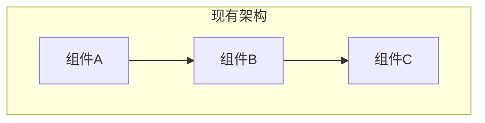
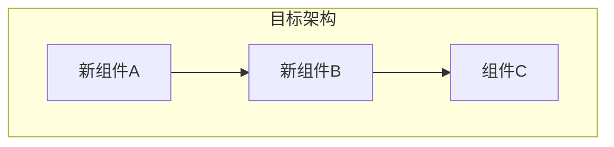

# HLD 模板：重构方案

> 以下为模板内容，复制后根据实际情况填写。

---

# [重构项目] 技术设计文档

## 元信息

| 项目 | 内容 |
|------|------|
| 关联 PRD | [PRD 文档链接] |
| 版本 | v1.0 |
| 作者 | [作者] |
| 影响范围 | [服务/模块列表] |

## PRD↔HLD 需求映射表

| PRD 条目 | 验收标准 | HLD 章节 | 状态 |
|----------|---------|---------|------|
| [FR-XXX] | [验收标准] | [对应章节] | ✓/进行中/待定 |

## 1. 重构背景

### 1.1 现状问题
| 问题 | 影响 | 严重程度 |
|------|------|---------|
| [问题1] | [影响] | 高/中/低 |

### 1.2 重构目标
- [目标 1]
- [目标 2]

### 1.3 非目标（明确不做）
- [非目标 1]

### 1.4 成功指标
| 指标 | 当前值 | 目标值 |
|------|--------|--------|
| [指标] | [当前] | [目标] |

## 2. 现有架构分析

### 2.1 现有架构图

### 2.2 问题定位
[哪些组件/模块需要重构、为什么]

### 2.3 依赖分析
| 被依赖组件 | 依赖方 | 影响评估 |
|-----------|--------|---------|
| [组件] | [依赖方] | [影响] |

## 3. 目标架构

### 3.1 目标架构图

### 3.2 复用盘点

| 能力需求 | 候选方案 | 评估结论 | 来源 |
|---------|---------|---------|------|
| [能力1] | 内部模块 A / 第三方 B / 自研 | [选择及理由] | [文档/代码路径] |

> 说明：
> - 重构过程中优先复用已有模块，避免重复造轮子
> - **「来源」列必填**：必须注明从哪个文档或代码中识别到该候选方案，禁止无依据猜测

### 3.3 架构变更说明
| 变更点 | 变更前 | 变更后 | 理由 |
|--------|--------|--------|------|
| [变更] | [前] | [后] | [理由] |

### 3.4 技术选型变更
| 组件 | 变更前 | 变更后 | 理由 |
|------|--------|--------|------|
| [组件] | [前] | [后] | [理由] |

## 4. 迁移策略

### 4.1 迁移方式
- [ ] 大爆炸式（一次性切换）
- [ ] 渐进式（逐步迁移）
- [ ] 绞杀者模式（新旧并行）

### 4.2 迁移步骤

| 阶段 | 内容 | 回滚点 |
|------|------|--------|
| 阶段1 | [内容] | [回滚方式] |

### 4.3 数据迁移
[数据迁移策略、一致性保证]

## 5. 兼容性设计

### 5.1 API 兼容
| 接口 | 兼容策略 |
|------|---------|
| [接口] | [策略] |

### 5.2 数据兼容
[新旧数据格式兼容]

### 5.3 配置兼容
[配置变更、开关控制]

## 6. 风险与缓解

### 6.1 技术风险
| 风险 | 概率 | 影响 | 缓解措施 |
|------|------|------|---------|
| [风险] | 高/中/低 | [影响] | [措施] |

### 6.2 业务风险
| 风险 | 影响 | 缓解措施 |
|------|------|---------|
| 服务中断 | [影响] | [措施] |

## 7. 回滚方案

### 7.1 回滚触发条件
- [条件 1]
- [条件 2]

### 7.2 回滚步骤
1. [步骤 1]
2. [步骤 2]

### 7.3 回滚验证
[如何验证回滚成功]

## 8. 测试策略

### 8.1 测试范围
| 测试类型 | 覆盖范围 |
|---------|---------|
| 单元测试 | [范围] |
| 集成测试 | [范围] |
| 性能测试 | [范围] |

### 8.2 对比测试
[新旧系统对比验证策略]

## 9. 上线计划

### 9.1 灰度策略
| 阶段 | 灰度比例 | 持续时间 | 观察指标 |
|------|---------|---------|---------|
| [阶段] | X% | X天 | [指标] |

### 9.2 监控增强
[重构期间额外的监控措施]

### 9.3 埋点/监控设计（承接 PRD 成功指标）

| PRD 成功指标 | 埋点/监控设计 |
|-------------|--------------|
| [指标名] | [采集方式、存储、展示] |

## 10. 清理计划

### 10.1 废弃组件
| 组件 | 计划下线时间 | 依赖检查 |
|------|-------------|---------|
| [组件] | [时间] | [检查] |

### 10.2 技术债清理
[遗留技术债处理计划]
