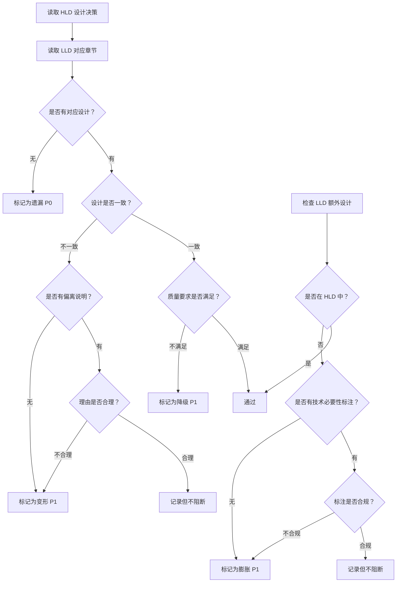

# HLD→LLD 漂移检测指南

本文档定义了 HLD→LLD 漂移的类型、判定标准和检测方法。

## 漂移的危害

在多 AI Agent 协同工作流中，HLD→LLD 漂移会导致：
- 实现偏离架构设计
- 技术债务累积
- 系统质量下降
- 维护成本增加

## 漂移类型定义

### 1. 遗漏（Omission）

**定义**：HLD 有明确设计，但 LLD 中没有对应实现设计。

**严重度**：P0（阻断）

**判定标准**：
- HLD 中的架构决策在 LLD 中完全没有体现
- HLD 中的模块/组件在 LLD 中没有对应设计
- HLD 中的接口在 LLD 中没有实现设计

**检测方法**：
1. 提取 HLD 中所有架构决策点
2. 逐条检查 LLD 是否有对应设计
3. 使用追溯映射表验证覆盖率

**示例**：

| HLD 设计 | LLD 覆盖 | 判定 |
|----------|----------|------|
| 「采用 Redis 缓存热点数据」 | LLD 无缓存设计 | ❌ 遗漏 |
| 「实现熔断机制」 | LLD 无熔断设计 | ❌ 遗漏 |

---

### 2. 膨胀（Inflation）

**定义**：LLD 中有设计内容，但 HLD 中没有对应的架构决策。

**严重度**：P1（严重）- 若无技术必要性标注

**判定标准**：
- LLD 引入了 HLD 未定义的新模块
- LLD 引入了 HLD 未定义的新组件
- LLD 引入了 HLD 未定义的新接口

**「技术必要性」合规标准**：

| 标准 | 描述 | 有效示例 | 无效示例 |
|------|------|----------|----------|
| **实现依赖** | 无此设计则功能无法实现 | 「JWT 解析需要密钥管理」 | 「加个配置中心更好」 |
| **安全合规** | 安全/合规强制要求 | 「GDPR 要求审计日志」 | 「建议加日志」 |
| **稳定性保障** | 无此设计系统不稳定 | 「高并发需要限流组件」 | 「加限流更完善」 |
| **行业惯例** | 公认的工程最佳实践 | 「数据库连接池是必需的」 | 「连接池更规范」 |

**标注格式要求**：
```
技术必要性：[具体原因]
关联 HLD 决策：[HLD 章节/决策]
```

**检测方法**：
1. 提取 LLD 中所有设计决策
2. 检查是否能在 HLD 中找到对应来源
3. 若无来源，检查是否有合规的技术必要性标注

---

### 3. 变形（Distortion）

**定义**：LLD 对 HLD 的理解偏离原意。

**严重度**：P1（严重）

**判定标准**：
- LLD 的实现方式与 HLD 的设计意图不符
- LLD 改变了 HLD 定义的数据流
- LLD 改变了 HLD 定义的控制流
- LLD 改变了 HLD 定义的组件职责

**检测方法**：
1. 理解 HLD 设计的意图和上下文
2. 对比 LLD 实现是否符合意图
3. 检查是否有「偏离说明」和合理理由

**示例**：

| HLD 设计 | LLD 实现 | 判定 |
|----------|----------|------|
| 「用户服务负责认证」 | 「认证逻辑放在网关」 | ⚠️ 变形（需说明理由） |
| 「同步调用下游服务」 | 「改为异步消息」 | ⚠️ 变形（需说明理由） |

---

### 4. 降级（Degradation）

**定义**：HLD 定义的质量要求在 LLD 中被放宽。

**严重度**：P1（严重）

**判定标准**：
- HLD 定义的性能指标在 LLD 中被降低
- HLD 定义的可靠性要求在 LLD 中被放宽
- HLD 定义的安全要求在 LLD 中被简化
- HLD 定义的可观测性要求在 LLD 中被削减

**检测方法**：
1. 提取 HLD 中的质量要求（性能/可靠性/安全/可观测性）
2. 对比 LLD 中的对应设计
3. 检查是否有质量下降

**示例**：

| HLD 要求 | LLD 设计 | 判定 |
|----------|----------|------|
| 「P99 响应时间 < 100ms」 | 无性能设计 | ❌ 降级 |
| 「99.9% 可用性」 | 无高可用设计 | ❌ 降级 |
| 「敏感数据加密存储」 | 明文存储 | ❌ 降级 |

---

### 5. Contract 冲突（Contract Conflict）

**定义**：LLD 与 API Contract 不一致。

**严重度**：P0（阻断）

**判定标准**：
- 接口签名不一致（方法名、参数、返回值）
- 错误码不一致
- 权限定义不一致
- 请求/响应结构不一致

**检测方法**：
1. 逐个对比 LLD 接口设计与 Contract 定义
2. 检查字段名、类型、必填性
3. 检查错误码定义

**Contract 是事实源原则**：
- LLD 不得重写或改动 Contract
- 发现不一致时，LLD 必须修改以符合 Contract
- 若需修改 Contract，走变更流程

---

## 漂移检测流程



---

## 漂移报告格式

```markdown
## 漂移检测报告

### 统计
| 漂移类型 | 数量 | 严重度 |
|----------|------|--------|
| 遗漏 | {n} | P0 |
| 膨胀 | {n} | P1 |
| 变形 | {n} | P1 |
| 降级 | {n} | P1 |
| Contract 冲突 | {n} | P0 |

### 问题清单

| # | 类型 | HLD 位置 | LLD 位置 | 描述 | 严重度 |
|---|------|----------|----------|------|--------|
| 1 | 遗漏 | HLD:3.2 | — | {描述} | P0 |
| 2 | 膨胀 | — | LLD:4.1 | {描述} | P1 |
| 3 | Contract冲突 | Contract:POST /users | LLD:5.2 | {描述} | P0 |
```

---

## 最佳实践

### 预防漂移

1. **LLD 作者**：
   - 严格按照 HLD 设计编写 LLD
   - 引入新设计时，明确标注技术必要性
   - 偏离 HLD 时，说明理由

2. **LLD Reviewer**：
   - 使用追溯映射表验证覆盖率
   - 逐条检查 HLD→LLD 一致性
   - 对膨胀设计严格审查技术必要性

### 处理漂移

1. **遗漏**：要求 LLD 作者补充设计
2. **膨胀**：要求补充技术必要性标注，或删除多余设计
3. **变形**：要求说明理由，或修改为与 HLD 一致
4. **降级**：要求恢复质量要求，或说明合理理由
5. **Contract 冲突**：必须修改 LLD 以符合 Contract
