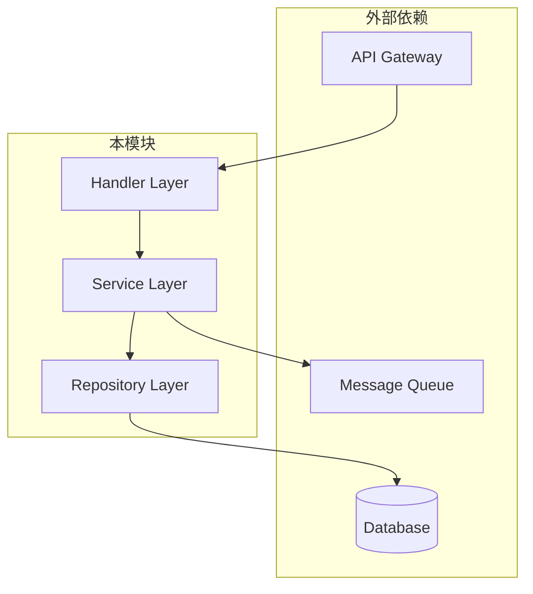
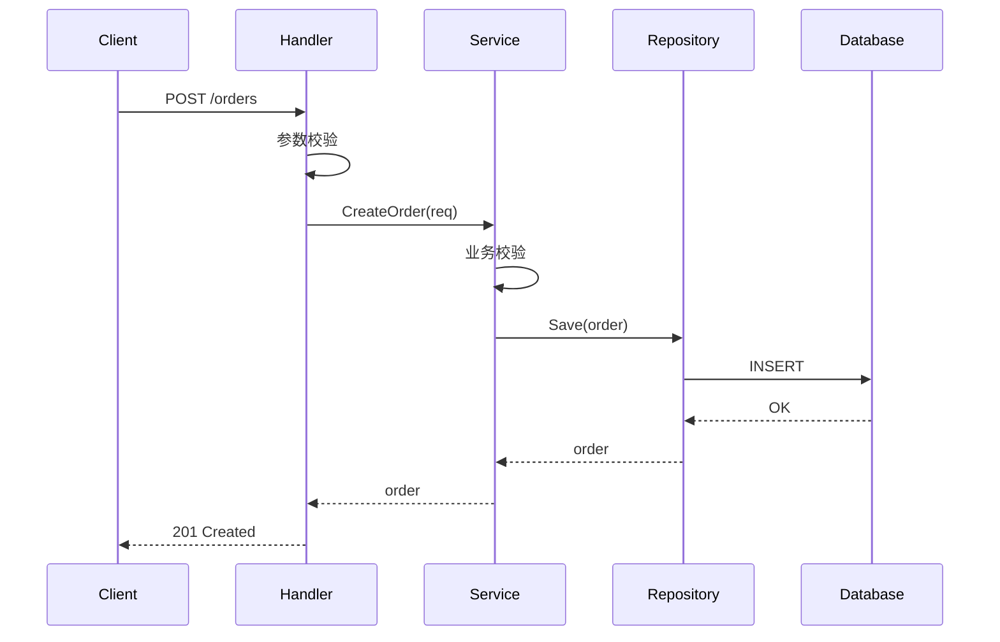
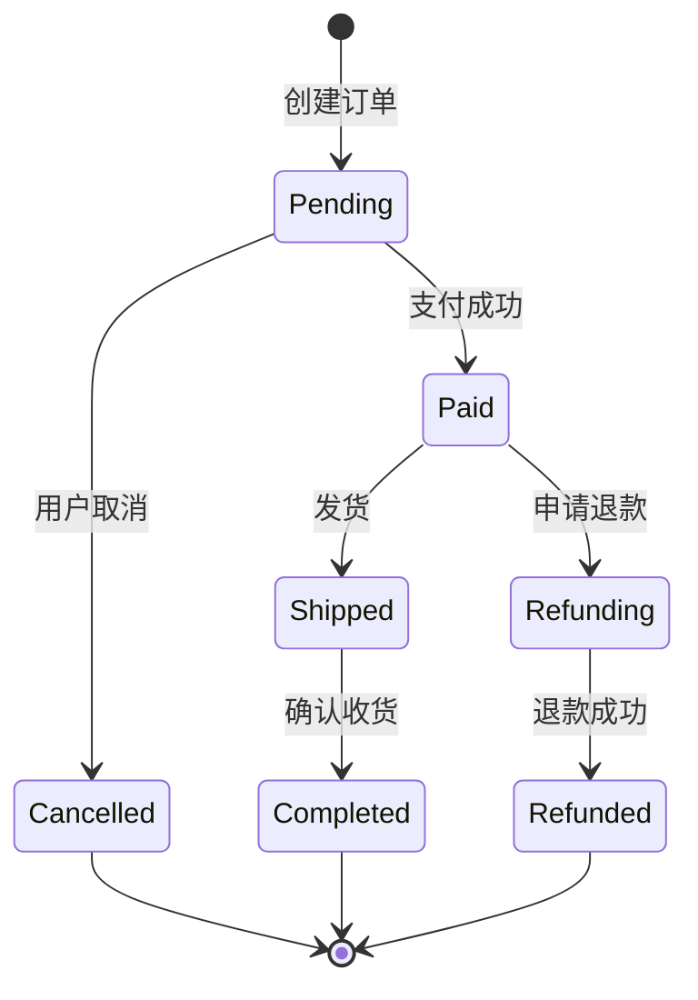

# LLD 文档模板（Core）

> 本模板为 LLD 核心章节，所有 LLD 必须包含这些内容。Add-on 模块章节见 `modules.md`。

---

## 1. 文档信息

| 属性 | 值 |
|------|-----|
| 文档名称 | LLD - {模块/功能名称} |
| 版本 | v1.0 |
| 作者 | {作者} |
| 创建日期 | {YYYY-MM-DD} |
| PRD 基线 | {PRD 文件路径} v{版本} |
| HLD 基线 | {HLD 文件路径} v{版本} |
| Contract 基线 | {Contract 文件路径} |
| Guardrails | {Guardrails 路径} / 无 |
| 状态 | 草稿 / 评审中 / 已批准 |

---

## 2. LLD Manifest

> 使用 `lld-manifest.md` 模板，列出本 LLD 包含的模块。

| 模块 | Included | N/A 理由 | 证据位置 | Guardrails 要求 |
|------|----------|----------|----------|----------------|
| Core | Y | - | 本文档 | 必须 |
| API Contract | {Y/N} | {理由} | {§X.X} | {是否强制} |
| Storage & Migration | {Y/N} | {理由} | {§X.X} | {是否强制} |
| ... | | | | |

---

## 3. 范围与假设

### 3.1 In-Scope（本 LLD 覆盖）

明确列出本 LLD 设计覆盖的功能/模块：

- {功能/模块 1}
- {功能/模块 2}
- ...

### 3.2 Out-of-Scope（本 LLD 不覆盖）

明确列出不在本 LLD 范围内的内容（避免歧义）：

- {不覆盖的功能 1}（原因：{由其他 LLD 覆盖 / 后续迭代}）
- ...

### 3.3 关键假设

列出设计依赖的假设，若假设不成立则设计需调整：

| # | 假设 | 依据 | 影响 |
|---|------|------|------|
| 1 | {假设描述} | {来源：HLD/PRD/用户确认} | {若不成立的影响} |

### 3.4 依赖

| 依赖项 | 类型 | 状态 | 负责方 |
|--------|------|------|--------|
| {服务/模块名} | 内部服务 / 外部 API / 共享库 | 已就绪 / 开发中 | {团队} |

---

## 4. 模块/包结构

### 4.1 目录结构

```
{module-name}/
├── cmd/                    # 入口/启动
│   └── main.go
├── internal/               # 内部实现（不可外部导入）
│   ├── handler/           # 请求处理层
│   ├── service/           # 业务逻辑层
│   ├── repository/        # 数据访问层
│   └── model/             # 内部模型
├── pkg/                    # 可导出的公共包
│   └── dto/               # 数据传输对象
├── config/                 # 配置
└── test/                   # 测试
    ├── unit/
    └── integration/
```

> 根据实际技术栈调整目录结构（如 Java 用 `src/main/java`，Python 用 `src/`）

### 4.2 依赖关系图



### 4.3 包/模块职责

| 包/模块 | 职责 | 依赖 |
|---------|------|------|
| `handler` | 请求解析、参数校验、响应封装 | `service` |
| `service` | 业务逻辑编排 | `repository`, `client` |
| `repository` | 数据持久化 | `model` |

---

## 5. 关键接口与函数签名

### 5.1 核心接口定义

```go
// OrderService 订单服务接口
type OrderService interface {
    // CreateOrder 创建订单
    // 参数: ctx - 上下文, req - 创建请求
    // 返回: 订单实体, 错误
    CreateOrder(ctx context.Context, req *CreateOrderRequest) (*Order, error)

    // GetOrder 查询订单
    GetOrder(ctx context.Context, orderID string) (*Order, error)

    // CancelOrder 取消订单
    CancelOrder(ctx context.Context, orderID string, reason string) error
}
```

> 根据实际语言调整语法（TypeScript/Java/Python 等）

### 5.2 关键方法签名

| 方法 | 输入 | 输出 | 说明 |
|------|------|------|------|
| `CreateOrder` | `CreateOrderRequest` | `Order, error` | 创建新订单 |
| `GetOrder` | `orderID: string` | `Order, error` | 按 ID 查询 |
| `CancelOrder` | `orderID, reason` | `error` | 取消订单 |

### 5.3 Contract 映射

> 引用 API Contract，说明接口到函数的映射关系

| Contract 接口 | 函数/方法 | 说明 |
|---------------|----------|------|
| `POST /api/v1/orders` | `OrderService.CreateOrder` | - |
| `GET /api/v1/orders/{id}` | `OrderService.GetOrder` | - |

---

## 6. 数据结构与 DTO

### 6.1 核心数据结构

```go
// Order 订单实体（内部模型）
type Order struct {
    ID          string       `json:"id"`
    UserID      string       `json:"user_id"`
    Items       []OrderItem  `json:"items"`
    TotalAmount int64        `json:"total_amount"` // 单位：分
    Status      OrderStatus  `json:"status"`
    CreatedAt   time.Time    `json:"created_at"`
    UpdatedAt   time.Time    `json:"updated_at"`
}

// OrderStatus 订单状态枚举
type OrderStatus string
const (
    OrderStatusPending   OrderStatus = "pending"
    OrderStatusPaid      OrderStatus = "paid"
    OrderStatusCancelled OrderStatus = "cancelled"
)
```

### 6.2 DTO（数据传输对象）

```go
// CreateOrderRequest 创建订单请求
type CreateOrderRequest struct {
    UserID string      `json:"user_id" validate:"required"`
    Items  []ItemInput `json:"items" validate:"required,min=1"`
}

// CreateOrderResponse 创建订单响应
type CreateOrderResponse struct {
    OrderID string `json:"order_id"`
    Status  string `json:"status"`
}
```

### 6.3 数据转换

| 来源 | 目标 | 转换方法 |
|------|------|----------|
| `CreateOrderRequest` | `Order` | `mapper.ToOrder()` |
| `Order` | `CreateOrderResponse` | `mapper.ToResponse()` |

---

## 7. 关键流程/伪代码

### 7.1 主流程（Happy Path）



### 7.2 关键分支伪代码

```python
def create_order(request):
    # 1. 参数校验
    if not validate(request):
        raise ValidationError("invalid request")

    # 2. 业务校验
    user = user_service.get_user(request.user_id)
    if not user.is_active:
        raise BusinessError("user not active")

    # 3. 库存检查
    for item in request.items:
        stock = inventory.check(item.product_id)
        if stock < item.quantity:
            raise BusinessError("insufficient stock")

    # 4. 创建订单
    order = Order(
        id=generate_id(),
        user_id=request.user_id,
        items=request.items,
        status=OrderStatus.PENDING
    )

    # 5. 持久化
    repository.save(order)

    # 6. 发送事件（如有）
    event_bus.publish(OrderCreatedEvent(order))

    return order
```

### 7.3 状态机（如适用）



---

## 8. 错误处理与异常分支

### 8.1 错误分类

| 错误类型 | 错误码范围 | 处理策略 | HTTP 状态码 |
|----------|-----------|----------|-------------|
| 参数校验错误 | 1001-1099 | 直接返回，不重试 | 400 |
| 业务规则错误 | 2001-2099 | 直接返回，不重试 | 422 |
| 资源不存在 | 3001-3099 | 直接返回 | 404 |
| 系统内部错误 | 5001-5099 | 记录日志，可重试 | 500 |
| 外部依赖错误 | 6001-6099 | 降级/重试/熔断 | 502/503 |

### 8.2 错误码定义

> 引用 Contract 中的错误码，补充内部错误码

| 错误码 | 名称 | 描述 | 处理建议 |
|--------|------|------|----------|
| `ORDER_1001` | `INVALID_PARAM` | 请求参数无效 | 检查参数格式 |
| `ORDER_2001` | `INSUFFICIENT_STOCK` | 库存不足 | 减少数量或更换商品 |
| `ORDER_2002` | `USER_NOT_ACTIVE` | 用户未激活 | 联系客服 |

### 8.3 异常处理流程

```python
try:
    result = service.create_order(request)
except ValidationError as e:
    return error_response(400, e.code, e.message)
except BusinessError as e:
    return error_response(422, e.code, e.message)
except ExternalServiceError as e:
    logger.error(f"External service failed: {e}")
    # 降级处理
    return fallback_response()
except Exception as e:
    logger.error(f"Unexpected error: {e}")
    return error_response(500, "INTERNAL_ERROR", "服务内部错误")
```

---

## 9. 并发/事务/幂等

### 9.1 并发模型

| 场景 | 并发策略 | 实现方式 |
|------|----------|----------|
| 订单创建 | 乐观锁 | 版本号校验 |
| 库存扣减 | 悲观锁 | SELECT FOR UPDATE |
| 状态更新 | CAS | 原子操作 |

### 9.2 事务边界

```python
@transactional
def create_order_with_stock_deduction(request):
    # 以下操作在同一事务中
    order = create_order(request)
    deduct_stock(request.items)
    return order
```

| 操作组合 | 事务策略 | 回滚条件 |
|----------|----------|----------|
| 创建订单 + 扣库存 | 同一事务 | 任一失败 |
| 创建订单 + 发通知 | 分离（最终一致） | 订单失败回滚，通知可重试 |

### 9.3 幂等设计

| 接口 | 幂等键 | 幂等策略 |
|------|--------|----------|
| 创建订单 | `request_id` | Token 防重（Redis SETNX） |
| 支付回调 | `payment_id` | 状态机幂等（已支付则跳过） |

```python
def create_order_idempotent(request_id, request):
    # 1. 检查幂等键
    if redis.exists(f"order:idempotent:{request_id}"):
        return get_existing_order(request_id)

    # 2. 设置幂等键（带过期时间）
    redis.setex(f"order:idempotent:{request_id}", 3600, "processing")

    # 3. 执行业务逻辑
    order = create_order(request)

    # 4. 更新幂等键
    redis.setex(f"order:idempotent:{request_id}", 86400, order.id)

    return order
```

---

## 10. 配置/Feature Flag

### 10.1 配置项

| 配置项 | 类型 | 默认值 | 说明 | 环境差异 |
|--------|------|--------|------|----------|
| `order.max_items` | int | 100 | 单笔订单最大商品数 | 无 |
| `order.timeout_minutes` | int | 30 | 未支付订单超时时间 | 无 |
| `db.pool_size` | int | 10 | 数据库连接池大小 | dev:5, prod:20 |

### 10.2 Feature Flag

| Flag | 默认值 | 说明 | 灰度策略 |
|------|--------|------|----------|
| `enable_new_pricing` | false | 新定价策略 | 按用户 ID 灰度 |
| `enable_async_notification` | true | 异步通知 | 全量 |

```python
if feature_flag.is_enabled("enable_new_pricing", user_id=user.id):
    price = new_pricing_service.calculate(items)
else:
    price = legacy_pricing_service.calculate(items)
```

---

## 11. 测试设计

### 11.1 单元测试范围

| 模块 | 测试重点 | 覆盖率目标 |
|------|----------|-----------|
| `service` | 业务逻辑分支 | ≥ 80% |
| `repository` | CRUD 操作 | ≥ 70% |
| `handler` | 参数校验、错误处理 | ≥ 70% |

### 11.2 集成测试

| 测试场景 | 依赖 | 测试方式 |
|----------|------|----------|
| 订单创建完整流程 | DB, MQ | TestContainer |
| 支付回调处理 | 支付服务 Mock | WireMock |

### 11.3 Mock/Fixture 策略

| 依赖 | Mock 方式 | 说明 |
|------|----------|------|
| 数据库 | TestContainer / SQLite | 集成测试用真实 DB |
| 外部 API | WireMock / httptest | 模拟外部服务响应 |
| 消息队列 | 内存队列 | 验证消息发送 |

### 11.4 关键测试用例

| # | 测试场景 | 输入 | 预期输出 |
|---|----------|------|----------|
| 1 | 正常创建订单 | 有效请求 | 订单创建成功 |
| 2 | 库存不足 | 超出库存的数量 | 返回库存不足错误 |
| 3 | 用户未激活 | 未激活用户 ID | 返回用户状态错误 |
| 4 | 幂等重复请求 | 相同 request_id | 返回已存在的订单 |

---

## 12. 追溯映射

| 上游条目 | 来源 | LLD 章节 | 状态 |
|----------|------|----------|------|
| {PRD-001} 创建订单功能 | PRD | §5, §7 | ✅ 已覆盖 |
| {PRD-002} 订单状态管理 | PRD | §7.3 | ✅ 已覆盖 |
| {HLD-001} 订单服务架构 | HLD | §4 | ✅ 已覆盖 |
| {HLD-002} 缓存策略 | HLD | §9 | ✅ 已覆盖 |
| `POST /api/v1/orders` | Contract | §5.3 | ✅ 已覆盖 |
| `GET /api/v1/orders/{id}` | Contract | §5.3 | ✅ 已覆盖 |

---

## 13. 待确认问题

| # | 问题 | 影响章节 | 状态 | 负责人 |
|---|------|----------|------|--------|
| 1 | {问题描述} | §X.X | 待确认 | {人员} |

---

## 14. 变更记录

| 版本 | 日期 | 变更内容 | 变更人 |
|------|------|----------|--------|
| v1.0 | {日期} | 初始版本 | {人员} |
