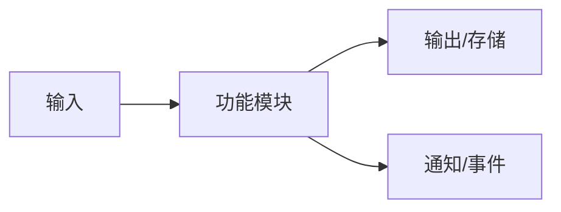
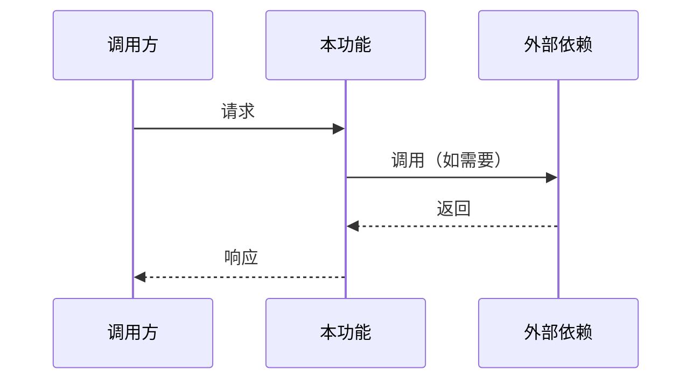

# PRD 模板：新功能（无 UI / 后端）

本模板适用于后端服务、API、后台任务等不涉及用户界面的新功能需求。

---

## 文档结构

```markdown
# PRD: [功能名称]

> **文档版本**: X.X
> **状态**: 草稿 / 评审中 / 已批准
> **作者**: [作者姓名]
> **创建日期**: YYYY-MM-DD
> **最后更新**: YYYY-MM-DD

---

## 1. 文档信息

### 1.1 基本信息

| 属性 | 值 |
|------|-----|
| PRD 编号 | PRD-XXX |
| 所属产品 | [产品名称] |
| 优先级 | P0 / P1 / P2 / P3 |
| 预计版本 | vX.X |
| PRD 基线版本 | vX.X（HLD 基于此版本） |
| 最后同步日期 | YYYY-MM-DD |

### 1.2 修订历史

| 版本 | 日期 | 变更内容 | 作者 |
|------|------|----------|------|
| X.X | YYYY-MM-DD | [变更描述] | [作者] |

### 1.3 术语表

| 术语 | 定义 |
|------|------|
| [术语] | [定义] |

---

## 2. 背景与目标

### 2.1 业务背景

[描述业务痛点或机会]

### 2.2 产品目标

[描述产品目标]

### 2.3 成功指标

| 指标 | 目标值 | 数据来源 | 度量方式 |
|------|--------|----------|----------|
| [指标] | [目标值] | 已有埋点/需新增/人工统计 | [度量方式] |

### 2.4 业务现状（如为已有系统新增功能）

#### 当前流程
[描述当前系统如何处理相关业务，如为全新功能可标注"不适用"]

#### 业务变更
| 变更项 | 变更前 | 变更后 |
|--------|--------|--------|
| [流程/功能] | [当前状态] | [目标状态] |

#### 影响范围
| 影响对象 | 影响描述 |
|----------|----------|
| 调用方 | [受影响的调用方] |
| 现有流程 | [受影响的流程] |
| 上下游系统 | [受影响的系统] |

### 2.5 相关能力识别（强制）

| 已有能力 | 能力范围 | 与本需求匹配度 | 能力差距 | 建议方向 | 来源 |
|----------|---------|--------------|---------|---------|------|
| [能力名称] | [该能力覆盖的范围] | 完全匹配/部分匹配/不匹配 | [差距描述，无差距填"无"] | 建议复用/建议扩展/仅供参考/需新建 | [文档/代码路径] |

> **说明**：
> - 此表为强制输出，确保识别所有可能相关的已有能力
> - **「来源」列必填**：必须注明从哪个文档或代码中识别到该能力，禁止无依据猜测
> - 「建议方向」仅为 PRD 建议，最终复用决策属于 HLD 范畴
> - 如确认无相关能力，填写"经排查，无相关已有能力"并说明**排查范围**（搜索了哪些路径/关键词）

---

## 3. 范围

### 3.1 范围内

- [功能/变更 1]

### 3.2 范围外

- [不在范围内的事项]

### 3.3 待确认事项

- [ ] [待确认事项]

---

## 4. 系统概述

### 4.1 功能概述

[简要描述该功能的整体职责和边界]

### 4.2 调用方

| 调用方 | 调用场景 |
|--------|----------|
| [调用方] | [场景描述] |

### 4.3 能力概览

[使用 Mermaid 描述功能提供的能力和数据流向]



> 具体技术架构见 HLD

---

## 5. 功能需求

### 5.X [功能模块名称]

#### 5.X.1 功能描述

[描述该模块的功能目的和业务价值]

#### 5.X.2 处理流程

[使用 Mermaid 时序图或流程图描述业务流程]



#### 5.X.3 业务规则

| 规则编号 | 规则描述 | 触发条件 |
|----------|----------|----------|
| BR-001 | [规则描述] | [条件] |

#### 5.X.4 输入输出

**输入**：
- [描述需要什么输入数据]

**输出**：
- [描述产生什么输出]

**副作用**：
- [描述会产生什么副作用，如发送通知、写入记录等]

---

## 6. 接口能力

[描述需要提供的接口能力，不规定具体路径和实现]

### 6.X [接口能力名称]

| 属性 | 说明 |
|------|------|
| 能力描述 | [这个接口做什么] |
| 调用方 | [谁会调用] |
| 认证要求 | 需要 / 不需要 |

#### 输入要求

[描述需要什么输入信息]

- [必需输入 1]
- [必需输入 2]
- [可选输入]

#### 输出要求

[描述返回什么信息]

- 成功时：[返回什么]
- 失败时：[返回什么错误信息]

#### 业务约束

- [约束 1]
- [约束 2]

> 具体 API 设计见 HLD

---

## 7. 数据概念

[描述涉及的业务实体和关系]

### 7.1 业务实体

| 实体 | 说明 | 关键属性 |
|------|------|----------|
| [实体名] | [业务含义] | [关键业务属性] |

### 7.2 实体关系

[描述实体间的业务关系]


> 具体数据模型设计见 HLD

---

## 8. 非功能需求

### 8.1 性能要求

| 场景 | 指标 | 要求 |
|------|------|------|
| [场景] | 响应时间 | P99 ≤ [X]ms |
| [场景] | 吞吐量 | ≥ [X] QPS |

### 8.2 可靠性要求

| 要求 | 目标 |
|------|------|
| 可用性 | [X]% |
| 数据持久性 | [描述] |

### 8.3 安全要求

| 要求 | 说明 |
|------|------|
| 认证 | [认证要求] |
| 授权 | [授权要求] |
| 数据保护 | [保护要求] |

### 8.4 兼容性要求

| 要求 | 说明 |
|------|------|
| 接口兼容 | [现有调用方是否受影响] |
| 数据兼容 | [现有数据是否受影响] |
| 协议兼容 | [通信协议是否变化] |

### 8.5 发布要求

| 要求 | 说明 |
|------|------|
| 灰度策略 | [是否需要灰度，灰度范围] |
| 回滚能力 | [是否需要支持回滚] |
| 功能开关 | [是否需要功能开关] |

> 注：具体灰度/回滚技术方案见 HLD

---

## 9. 依赖与约束

### 9.1 已知约束

- [业务约束]
- [时间约束]

### 9.2 外部依赖

- [依赖的第三方服务]

> 技术依赖详见 HLD

---

## 10. 项目计划

### 10.1 里程碑

| 里程碑 | 目标日期 | 交付物 |
|--------|----------|--------|
| [里程碑] | YYYY-MM-DD | [交付物] |

### 10.2 资源分配

| 角色 | 人员 | 投入 |
|------|------|------|
| [角色] | [人员] | [比例] |

---

## 11. 风险与缓解

| 风险 | 影响 | 概率 | 缓解措施 |
|------|------|------|----------|
| [风险] | 高/中/低 | 高/中/低 | [措施] |

---

## 12. 验收标准

### AC-001: [验收项名称]
- [ ] [验收条件]

---

## 13. 待澄清问题

| 编号 | 问题 | 提出人 | 状态 | 结论 |
|------|------|--------|------|------|
| Q1 | [问题] | [提出人] | 待讨论/已解决 | [结论] |

---

## 附录

[如有附加内容]
```

---

## 写作指导

### 系统概述章节

1. **功能概述**：一段话说清楚这个功能做什么
2. **调用方**：谁会使用这个功能，什么场景下使用
3. **能力概览**：用简单的流程图说明输入输出

### 功能需求章节

每个功能模块包含：

1. **功能描述**：业务目的和价值
2. **处理流程**：业务流程，不是技术实现
3. **业务规则**：业务逻辑约束
4. **输入输出**：需要什么，产生什么

### 接口能力章节

**注意**：PRD 只描述接口"能力"，不设计具体 API。

**正确写法**：
```markdown
### 创建订单能力

| 属性 | 说明 |
|------|------|
| 能力描述 | 根据购物车创建订单 |
| 调用方 | 前端购物车页面 |
| 认证要求 | 需要用户登录 |

#### 输入要求
- 购物车商品列表
- 收货地址
- 支付方式

#### 输出要求
- 成功时：返回订单号
- 失败时：返回失败原因
```

**错误写法（越界到 HLD）**：

    ### POST /api/v1/orders

    | 属性 | 值 |
    |------|-----|
    | 方法 | POST |
    | 路径 | /api/v1/orders |

    #### 请求体
    {
      "cart_id": "string",
      "address_id": "string"
    }

### 数据概念章节

**正确写法**：
```markdown
| 实体 | 说明 | 关键属性 |
|------|------|----------|
| 订单 | 用户的购买记录 | 订单号、金额、状态、下单时间 |
| 订单项 | 订单中的商品 | 商品名称、数量、单价 |
```

**错误写法（越界到 HLD）**：
```markdown
| 字段 | 类型 | 约束 |
|------|------|------|
| id | UUID | PRIMARY KEY |
| created_at | TIMESTAMP | NOT NULL |
```

### 业务规则表格

| 规则编号 | 规则描述 | 触发条件 |
|----------|----------|----------|
| BR-001 | 用户每日只能创建 10 个项目 | 创建项目时检查 |
| BR-002 | 订单超过 30 分钟未支付自动取消 | 定时检查 |

### 验收标准示例

```markdown
### AC-001: 创建订单
- [ ] 购物车有商品时可以创建订单
- [ ] 库存不足时提示用户并拒绝创建
- [ ] 创建成功后返回订单号
- [ ] 订单状态初始为"待支付"

### AC-002: 订单超时取消
- [ ] 30 分钟未支付的订单自动取消
- [ ] 取消时释放库存
- [ ] 发送取消通知（如配置了通知渠道）
```
