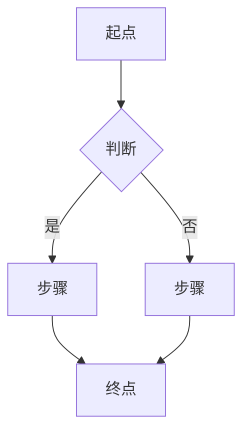
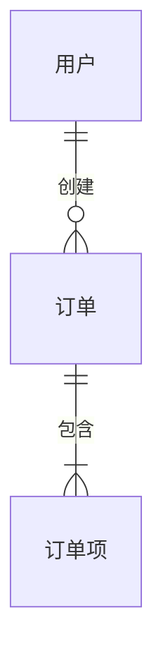

# PRD 模板：新功能（有 UI）

本模板适用于涉及用户界面的新功能需求。

---

## 文档结构

```markdown
# PRD: [功能名称]

> **文档版本**: X.X
> **状态**: 草稿 / 评审中 / 已批准
> **作者**: [作者姓名]
> **创建日期**: YYYY-MM-DD
> **最后更新**: YYYY-MM-DD

---

## 1. 文档信息

### 1.1 基本信息

| 属性 | 值 |
|------|-----|
| PRD 编号 | PRD-XXX |
| 所属产品 | [产品名称] |
| 优先级 | P0 / P1 / P2 / P3 |
| 预计版本 | vX.X |
| PRD 基线版本 | vX.X（HLD 基于此版本） |
| 最后同步日期 | YYYY-MM-DD |

### 1.2 修订历史

| 版本 | 日期 | 变更内容 | 作者 |
|------|------|----------|------|
| X.X | YYYY-MM-DD | [变更描述] | [作者] |

### 1.3 术语表

| 术语 | 定义 |
|------|------|
| [术语] | [定义] |

---

## 2. 背景与目标

### 2.1 业务背景

[描述业务痛点或机会]

### 2.2 产品目标

[描述产品目标，用户能获得什么价值]

### 2.3 成功指标

| 指标 | 目标值 | 数据来源 | 度量方式 |
|------|--------|----------|----------|
| [指标] | [目标值] | 已有埋点/需新增/人工统计 | [度量方式] |

### 2.4 业务现状（如为已有系统新增功能）

#### 当前流程
[描述当前用户如何完成相关任务，如为全新功能可标注"不适用"]

#### 业务变更
| 变更项 | 变更前 | 变更后 |
|--------|--------|--------|
| [流程/功能] | [当前状态] | [目标状态] |

#### 影响范围
| 影响对象 | 影响描述 |
|----------|----------|
| 用户群体 | [受影响的用户] |
| 现有流程 | [受影响的流程] |
| 上下游系统 | [受影响的系统] |

### 2.5 相关能力识别（强制）

| 已有能力 | 能力范围 | 与本需求匹配度 | 能力差距 | 建议方向 | 来源 |
|----------|---------|--------------|---------|---------|------|
| [能力名称] | [该能力覆盖的范围] | 完全匹配/部分匹配/不匹配 | [差距描述，无差距填"无"] | 建议复用/建议扩展/仅供参考/需新建 | [文档/代码路径] |

> **说明**：
> - 此表为强制输出，确保识别所有可能相关的已有能力
> - **「来源」列必填**：必须注明从哪个文档或代码中识别到该能力，禁止无依据猜测
> - 「建议方向」仅为 PRD 建议，最终复用决策属于 HLD 范畴
> - 如确认无相关能力，填写"经排查，无相关已有能力"并说明**排查范围**（搜索了哪些路径/关键词）

---

## 3. 范围

### 3.1 范围内

- [功能/变更 1]
- [功能/变更 2]

### 3.2 范围外

- [不在范围内的事项]

### 3.3 待确认事项

- [ ] [待确认事项]

---

## 4. 用户旅程

### 4.1 目标用户

[描述目标用户画像]

### 4.2 前置条件

| 条件 | 说明 |
|------|------|
| [条件] | [说明] |

### 4.3 主流程

[使用 Mermaid 流程图描述]



### 4.4 异常流程

| 异常场景 | 处理方式 |
|----------|----------|
| [场景] | [处理方式] |

---

## 5. 功能需求

### 5.X [模块/页面名称]

#### 5.X.1 功能描述

[描述该模块的功能]

#### 5.X.2 UI 布局

[使用 ASCII 图或说明设计稿位置]

```
┌─────────────────────────────────────────────────────────────┐
│                         页面标题                             │
├─────────────────────────────────────────────────────────────┤
│                                                             │
│    ┌─────────────────────────────────────────────────┐     │
│    │  [组件区域]                                      │     │
│    │     [元素说明]                                   │     │
│    │     [按钮]                                       │     │
│    └─────────────────────────────────────────────────┘     │
│                                                             │
└─────────────────────────────────────────────────────────────┘
```

#### 5.X.3 交互规格

| 元素 | 交互 | 结果 |
|------|------|------|
| [元素] | [交互方式] | [预期结果] |

#### 5.X.4 状态说明

| 状态 | 条件 | UI 表现 |
|------|------|---------|
| [状态] | [触发条件] | [显示内容] |

#### 5.X.5 数据展示

| 字段 | 说明 | 格式 |
|------|------|------|
| [字段] | [业务含义] | [显示格式] |

---

## 6. 数据概念

[描述涉及的业务实体和关系，仅限概念层面]

### 6.1 业务实体

| 实体 | 说明 | 关键属性 |
|------|------|----------|
| [实体名] | [业务含义] | [关键业务属性，非技术字段] |

### 6.2 实体关系

[用简要文字或 Mermaid ER 图描述实体间的业务关系]



> 具体数据模型设计见 HLD

---

## 7. 非功能需求

### 7.1 性能要求

| 场景 | 要求 |
|------|------|
| 页面加载 | [要求] |
| 操作响应 | [要求] |

### 7.2 兼容性要求

| 平台/浏览器 | 最低版本 |
|-------------|----------|
| [平台] | [版本] |

### 7.3 向后兼容要求

| 要求 | 说明 |
|------|------|
| 旧版本客户端 | [是否需要兼容，如何兼容] |
| 现有数据 | [现有数据是否受影响] |
| 现有流程 | [现有用户流程是否保留] |

### 7.4 发布要求

| 要求 | 说明 |
|------|------|
| 灰度策略 | [是否需要灰度，灰度范围] |
| 回滚能力 | [是否需要支持回滚] |
| 功能开关 | [是否需要功能开关] |

> 注：具体灰度/回滚技术方案见 HLD

### 7.5 可访问性要求

[如适用]

---

## 8. 依赖与约束

### 8.1 已知约束

- [业务约束]
- [时间约束]
- [资源约束]

### 8.2 外部依赖

- [依赖的第三方服务或产品]

> 技术依赖详见 HLD

---

## 9. 项目计划

### 9.1 里程碑

| 里程碑 | 目标日期 | 交付物 |
|--------|----------|--------|
| [里程碑] | YYYY-MM-DD | [交付物] |

### 9.2 资源分配

| 角色 | 人员 | 投入 |
|------|------|------|
| [角色] | [人员] | [比例] |

---

## 10. 风险与缓解

| 风险 | 影响 | 概率 | 缓解措施 |
|------|------|------|----------|
| [风险] | 高/中/低 | 高/中/低 | [措施] |

---

## 11. 验收标准

### AC-001: [验收项名称]
- [ ] [验收条件 1]
- [ ] [验收条件 2]

### UX-001: [用户体验验收项]
- [ ] [验收条件]

---

## 12. 待澄清问题

| 编号 | 问题 | 提出人 | 状态 | 结论 |
|------|------|--------|------|------|
| Q1 | [问题] | [提出人] | 待讨论/已解决 | [结论] |

---

## 附录

[如有附加内容]
```

---

## 写作指导

### 用户旅程章节

1. **目标用户**：描述用户画像，包括角色、技术水平、使用场景
2. **前置条件**：用户进入该流程前需要满足的条件
3. **主流程**：用 Mermaid 流程图描述，关注用户视角而非系统视角
4. **异常流程**：列出可能的异常情况和处理方式

### 功能需求章节

每个页面/模块包含：

1. **功能描述**：简要说明功能目的
2. **UI 布局**：使用 ASCII 图描述页面结构，或指明设计稿位置
3. **交互规格**：表格形式说明每个可交互元素的行为
4. **状态说明**：页面/组件的不同状态及触发条件
5. **数据展示**：展示哪些数据，格式是什么

### 数据概念章节

**注意**：PRD 只描述业务概念，不规定技术实现。

**正确写法**：
```markdown
| 实体 | 说明 | 关键属性 |
|------|------|----------|
| 订单 | 用户的购买记录 | 订单号、金额、状态、下单时间 |
| 订单项 | 订单中的商品 | 商品名称、数量、单价 |
```

**错误写法（越界到 HLD）**：
```markdown
| 字段 | 类型 | 约束 |
|------|------|------|
| id | UUID | PRIMARY KEY |
| created_at | TIMESTAMP | NOT NULL |
```

### UI 布局 ASCII 图规范

```
┌───────────┐  - 页面/区域边框
│           │
├───────────┤  - 分隔线
│           │
└───────────┘

[按钮]         - 可点击元素
「输入框」      - 输入元素
○ 单选         - 单选按钮
☑ 复选         - 复选框
▼ 下拉         - 下拉菜单
```

### 交互规格表格

| 元素 | 交互 | 结果 |
|------|------|------|
| 提交按钮 | 点击 | 校验表单，成功则提交并显示成功提示 |
| 取消按钮 | 点击 | 关闭弹窗，不保存数据 |
| 输入框 | 输入 | 实时校验，错误时显示红色边框和提示 |
| 列表项 | 点击 | 跳转到详情页 |
| 列表项 | 长按 | 显示操作菜单 |

### 验收标准示例

```markdown
### AC-001: 用户登录
- [ ] 输入正确的用户名和密码，点击登录，成功进入首页
- [ ] 输入错误的密码，显示"用户名或密码错误"提示
- [ ] 连续输错 5 次，账户锁定 15 分钟
- [ ] 登录状态保持 7 天（除非主动退出）

### UX-001: 登录页面体验
- [ ] 页面加载时间 ≤ 2 秒
- [ ] 支持键盘 Tab 切换焦点
- [ ] 密码输入框支持显示/隐藏切换
```
